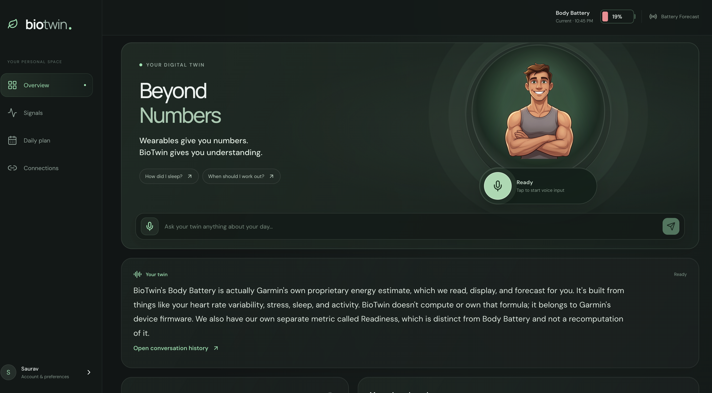
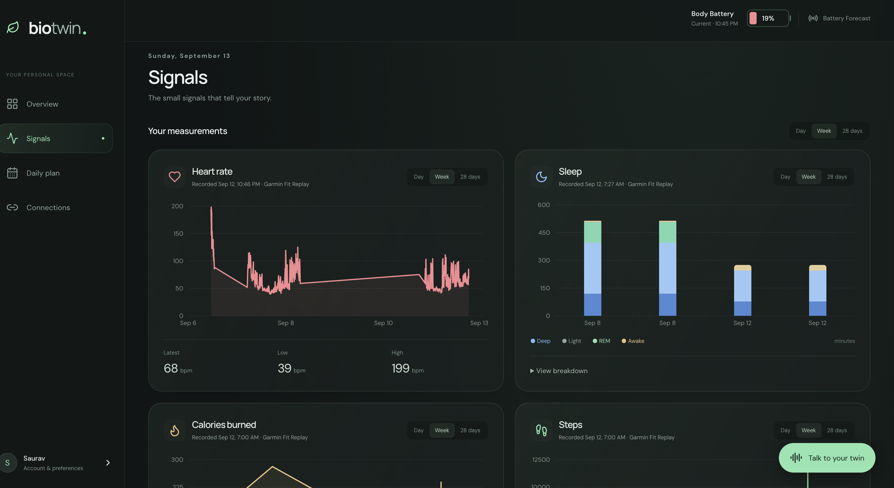
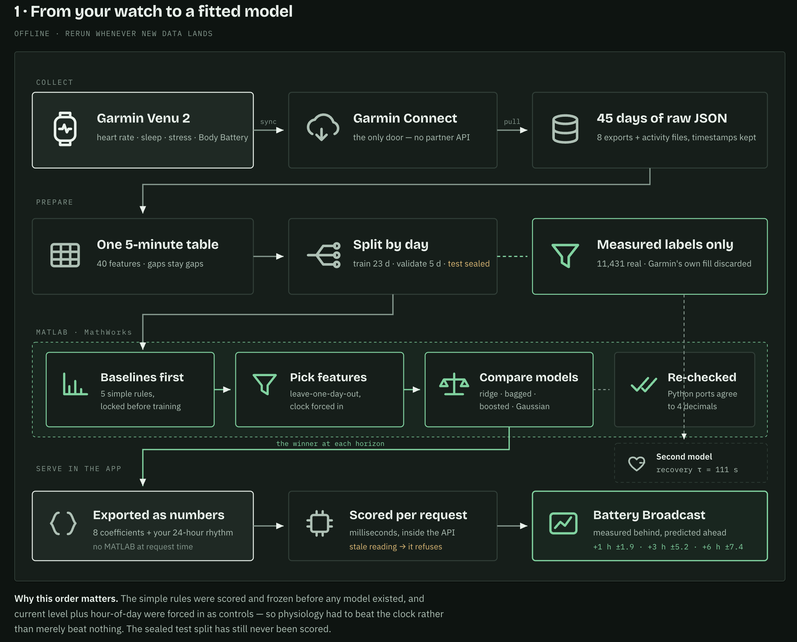
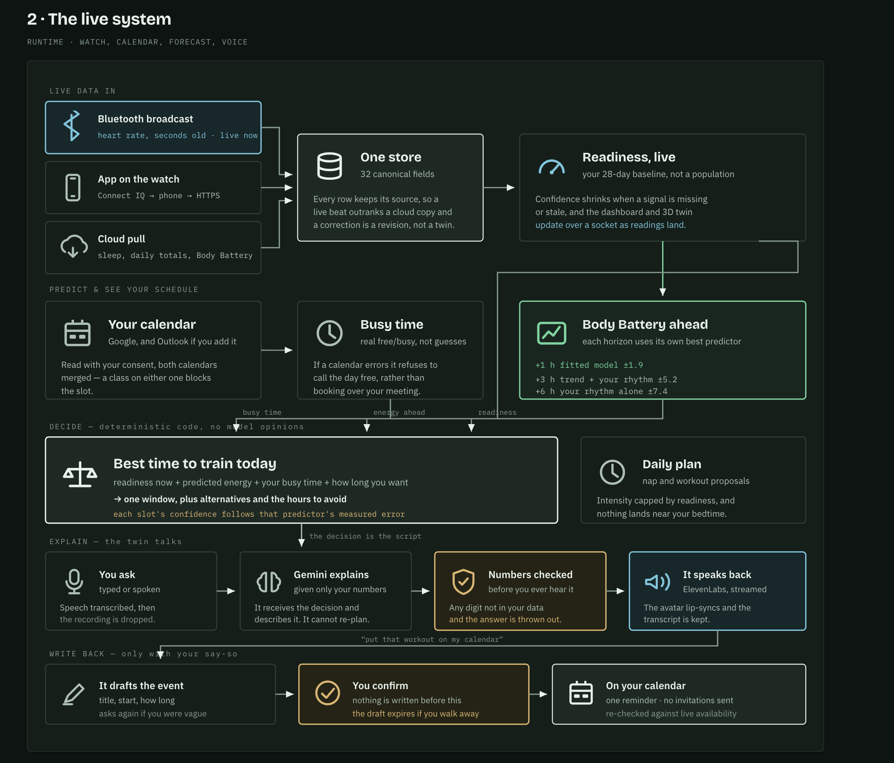

# BioTwin

### Beyond Numbers

> Wearables give you numbers. BioTwin gives you understanding.

Most fitness trackers hand you a wall of stats and leave you to figure out what they actually mean. BioTwin is different: it's a personal health twin you can just talk to.

Ask it how you slept, why you're feeling tired, or when you should work out today, and it answers out loud, in plain language, based on your real data. It doesn't just report numbers, it tells you what they mean for you, and even helps plan your day around them, right down to booking a workout on your actual calendar.

Your watch tells you what happened. BioTwin tells you what it means.

Built for **HackRice 2026**.

**[Watch the demo on YouTube](https://youtu.be/T8H4S3MSeT4)**

## Screenshots

<p align="center">
  
  
</p>

### How it works

<p align="center">
  
</p>

<p align="center">
  
</p>

## Run locally

Requires Python 3.12+, [uv](https://docs.astral.sh/uv/), and Node 22+.

```sh
uv sync --frozen
npm ci --prefix frontend
uv run python -m scripts.setup
npm run build --prefix frontend
uv run uvicorn core.api:app --host 0.0.0.0 --port 8000 --no-access-log
```

Open **http://localhost:8000**. For frontend hot reload, run `bash scripts/dev.sh` and open http://localhost:5173. Offline installation must be tested using the production build on port 8000.

Create an adult account from "Connect your own data." In Connections, import an original Garmin `.FIT` activity or a supported JSON export. `.FIT` activities provide recorded heart rate; they do not necessarily contain sleep or RMSSD HRV. Missing signals stay missing and reduce readiness confidence.

### LAN access (share your dev server with a teammate)

Both dev servers listen on `0.0.0.0` by default, so anyone on the same WiFi can reach them at your machine's LAN IP instead of `localhost`. Find that IP:

```sh
# macOS
ipconfig getifaddr en0
# Linux
hostname -I
# Windows (PowerShell)
ipconfig
```

Set `LAN_ORIGIN` in `.env` to that address with the frontend's port, e.g. `LAN_ORIGIN=http://192.168.1.23:5173`, and restart `bash scripts/dev.sh` (or the production server) so the backend accepts it. A teammate on the same WiFi opens `http://192.168.1.23:5173` in their browser; narration and speech are server-side, so your host machine's credentials cover every LAN visitor (see [docs/INTEGRATIONS.md](docs/INTEGRATIONS.md)). Microphone recording requires a secure browser context: use HTTPS for phone/LAN voice capture; plain HTTP LAN addresses can still use typed chat.

## Features

- One ingestion pipeline for Garmin, Google Health/Fitbit, FIT/JSON imports, recorded replay, synthetic scenarios, and optional Bluetooth heart-rate broadcast.
- Durable, idempotent measurement storage with source disagreement, explicit quality/missingness, and authenticated WebSocket live updates.
- Weighted robust personal baselines, daily observation shrinkage, six readiness states with hysteresis, automatic recovery segmentation, and nonlinear time-constant fitting.
- Predictions stored before their observations; the original forecast is immutable and scored as a separate derived artifact.
- Original locally stored 3D human twin: articulated arms, hands, fingers, legs, feet and head; breathing/pulse driven by fresh measurements; exercise and recovery state machine.
- Heart rate, RMSSD, sleep stages, respiration, resting HR, oxygen saturation, steps, readiness history, and recovery graphs with provenance.
- Calendar-feasible nap/workout suggestions, an experimental day outlook, and calendar event creation with popup reminders.
- Typed or spoken questions answered by Gemini from the computed context, with evidence and numerical validation; ElevenLabs speech plays automatically with avatar gestures.
- Rest / light activity / exercise simulation on the same avatar and charts.
- Installable PWA with a production-generated synthetic offline bundle.
- Adult accounts, password hashing, opaque HttpOnly sessions, per-user envelope-encrypted provider tokens, export and deletion, and Docker deployment.

## Real integrations need setup

A Garmin watch paired to an iPhone is not a developer API credential. Garmin cloud data becomes accessible after the watch syncs to Garmin Connect and requires an approved developer integration. Fill in the ignored `.env` file using [the integration guide](docs/INTEGRATIONS.md):

| Integration | Needed | Current behavior without it |
|---|---|---|
| Garmin cloud | Approved Connect Developer access, client ID/secret, configured webhook | FIT/JSON imports and supported Bluetooth broadcast remain available |
| Fitbit / Google Health | OAuth client, enabled API, test users/approval, webhook setup | Clear setup error; no invented live data |
| Google Calendar | Google OAuth client and Calendar API enabled | Calendar proposals remain unavailable for real accounts |
| Gemini / Vertex AI | Vertex ADC + project/model (or AI Studio key), external narration enabled | Clearly labeled deterministic context explanation |
| ElevenLabs | API key and accessible voice ID | Grounded text works; speech reports setup required |

## Team accounts

A new teammate's login starts empty. `scripts/onboard_teammate.py` gives them their own account seeded with a replay copy of the `demo` account's current history instead of a blank dashboard:

```bash
PYTHONPATH=. uv run scripts/onboard_teammate.py --email teammate@example.com --name Teammate
```

## Verification

```sh
uv run pytest -q
npm run test --prefix frontend
bash scripts/check_schema.sh
npm run build --prefix frontend
```

See [verification evidence and limits](docs/VERIFICATION.md), [architecture](docs/ARCHITECTURE.md), [model assumptions](docs/MODEL_CARD.md), and [asset licenses](docs/LICENSES.md).

## Production deployment

The container serves the compiled frontend and FastAPI from one origin. Configure `.env`, set `POSTGRES_PASSWORD`, and run:

```sh
docker compose --env-file .env -f ops/docker-compose.yml up --build -d
```

Terminate TLS with the provided Caddy example or your host's proxy. Set `PUBLIC_URL` and `FRONTEND_ORIGIN` to the same HTTPS site URL and `COOKIE_SECURE=true`. Keep **one API worker** for the in-process WebSocket fan-out; horizontal scaling requires a shared broker.
