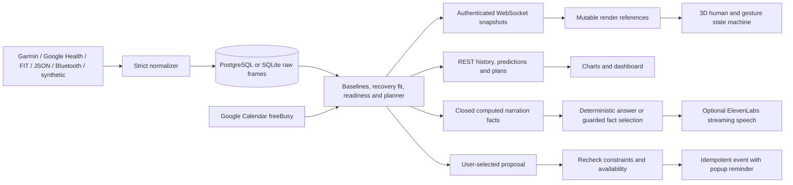

# Architecture

## Implemented data flow

`shared/schemas` defines the versioned Pydantic contracts. `schema.json` and the frontend types are generated, and CI checks drift. Schema version 1.0.0 is the initial release. Authentication/request DTOs and operational responses are outside the physiological contract package.

## Store and worker

`measurements` stores immutable **sparse frames**, rather than one SQL row per metric in the supplied design sketch. This preserves each adapter's simultaneous measurements and raw source metadata. The dedupe identity includes account, normalized source, event time, and measured values: an identical retry is ignored, while a vendor correction is preserved as a new revision. Consumers select the latest revision and prefer declared quality/source precedence over averaging conflicting sources.

A per-user sequence is incremented transactionally with each new frame. PostgreSQL locks the user row; SQLite uses a single-process lock and WAL. This release intentionally runs one API process. It does not claim distributed fan-out or distributed rate limiting.

Derived documents are separated by account, kind, and key. Issued predictions refuse overwrite. Their later scores are separate documents. Tokens are envelope-encrypted: a fresh data key protects each token document, and the server master key wraps that data key. Sessions store only hashes of opaque tokens. Passwords use salted scrypt.

The SQL outbox acknowledges verified webhook payloads after durable insertion. Workers claim jobs with leases and PostgreSQL `SKIP LOCKED`, retry with exponential backoff, and expose exhausted jobs in diagnostics. An event wakes the worker immediately rather than adding a polling interval to normal delivery.

Live state uses a per-source, per-metric latest-value index. In-order frames append without resorting the whole history. Late frames use ordered insertion and invalidate the baseline. Prediction scoring examines only the forecast's time window. The original retained history is available for rebuilding derived values.

## Transport and presentation

WebSockets authenticate with the HttpOnly account session. A client-supplied user ID is ignored. The server keeps 500 states per user and one pending snapshot per connected client, sends heartbeats, resumes when possible, and sends a fresh snapshot when resume history is absent. Slow writers have bounded timeouts; intermediate snapshots coalesce.

Steady-state snapshots contain **prediction metadata only**: chart curves and observed histories are fetched over REST. This keeps physiological updates small. The frontend retains drivers in mutable references; the Three.js frame loop reads those references and mutates the local model. Dashboard text samples snapshots separately. Rendering is independent of data arrival cadence.

The GLB is an original articulated adult-shaped mannequin with named joint groups. Procedural joint transforms replace purchased animation clips. The base activity FSM and additive readiness posture are separate; critically damped interpolation smooths each transition. The PEAK posture includes a double-bicep gesture. Finger/hand and foot/leg motion come from those same drivers. Speaking adds restrained gestures and approximate mouth motion; it is not phoneme-aligned lip sync.

## Offline and dependency failures

The offline bundle is generated using the production synthetic adapter, normalizer, store and model. It contains only synthetic measurements. The same renderer consumes these states and shows a persistent OFFLINE / REPLAY banner. The service worker never stores personal API responses. A public demo account cannot write calendar events or import into a personal workspace.

SQLite is an explicit supported storage mode. A running personal database is **not automatically replaced with a different empty SQLite database** after a PostgreSQL failure: writes return an explicit unavailable response and the UI's labeled offline replay takes over. This avoids silently splitting user identity, token, and measurement histories. The full local SQLite deployment works without PostgreSQL.

Unavailable calendars produce no purportedly conflict-free recommendations. The user changed the initial read-only requirement: selected proposals can now create real Google Calendar events with reminders. Before each insertion, the backend validates the stored proposal against current constraints, checks current availability, and uses an idempotent event ID.

Narration selects only precomputed facts; the optional language service returns fact indexes, not free-form physiological explanations. The default offline-safe template path requires no language key. ElevenLabs reads the resulting answer and cannot access wearable credentials or raw history.

## Security boundaries and deployment limits

- Account-scoped APIs, WebSocket sessions, encrypted tokens, minimal provider scopes, CSRF origin checks, request-size caps, and input validation.
- Public diagnostics contain operational counts and error classes, not measured health values or tokens.
- Configurable raw measurement retention; account deletion removes measurements, derived documents, sessions, tokens, and that account's pending webhook records while preserving other users in shared batches.
- TLS is required for public deployment and webhooks. Local HTTP is supported for loopback development only. `COOKIE_SECURE=true` must be set behind public HTTPS.
- Initial database creation is handled by SQLAlchemy metadata. Future schema changes need a real migration; there is no preexisting database migration to perform in this first release.
- A configured, credentialed integration is not the same as a verified live integration. See `INTEGRATIONS.md` for the external dependencies still needed.
